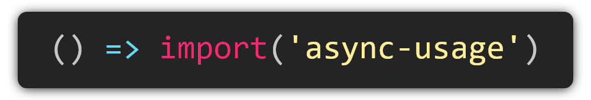

<h1 align="center">
  
</h1>

<p align="center">
  <a href="https://travis-ci.org/KazanExpress/async-usage"></a> <a href="https://coveralls.io/github/KazanExpress/async-usage?branch=master"></a> <a href="https://www.npmjs.com/package/async-usage"></a> 
  <a href=""></a> <a href=""></a>
</p>

<p align="center">
  Declarative dynamic imports for everyone!
</p>

<p align="center"><code>npm i -S async-usage</code></p>


## What is it?

It's a simple tool for creating environment specific dynamic import factories with pluginable functionality.

You can use it to reduce code repetition in your project's imports.

## TLDR

This tool allows you to create [dynamic import factories](https://developer.mozilla.org/en-US/docs/Web/JavaScript/Reference/Statements/import#Dynamic_Imports) to help your project be KISS and DRY. 😉

Mostly designed to work with [webpack](http://webpackjs.org), but can be easily tuned to work with other bundlers or even native browser dynamic imports.

Its simple - just create your specific async chunk use-case:

```ts
// Import the `createAsyncUsage` function
import { createAsyncUsage } from 'async-usage';

// Define the factory function to generate your imports
const importFactory = (path) => import(
  // Baked in webpack's "magic comments"
  /* webpackChunkName: "[request]" */
  /* webpackMode: "lazy" */

  // If using webpack, always start your factory path with a constant string,
  // so that webpack knows where to look to avoid complete module bundling.
  '@/' + path
);

// Create your final usage function
const useComponents = createAsyncUsage(
  importFactory, // Pass the import factory as the 1-st argument
  'components'   // Pass the base path as the second argument
);
```

And then use it 😉:

```ts
const components = useComponents(
  // Object options:
  // key - final imported module name alias
  // value - path to the module, relative to the base path passed into `createAsyncUsage`
  {
    'cool-component-base': 'path/to/cool/component-base',
    'some-component-top': 'path/to/some/component-top',
    'other-component': 'other/component',
  }

// You can then chain the call to avoid unnecessary object spreads
// Aliases for chaining: 'and', 'with'
).and(
  // Array options:
  // value - both path to the module AND its imported alias
  // `/` in the path will be replaced with `-` for the module alias
  [
    'home/page-slider'
  ],
  // Optional absolute path to the module from your importFactory root.
  'pages/home/components'
).clean();


// Result:
components === {
  'cool-component-base': () => import(
    /* webpackChunkName: "[request]" */
    /* webpackMode: "lazy" */
    '@/components/path/to/cool/component-base'
  ),
  'some-component-top': () => import(
    /* webpackChunkName: "[request]" */
    /* webpackMode: "lazy" */
    '@/components/path/to/some-component-top'
  ),
  'other-component': () => import(
    /* webpackChunkName: "[request]" */
    /* webpackMode: "lazy" */
    '@/components/other/component'
  ),
  'home-page-slider': () => import(
    /* webpackChunkName: "[request]" */
    /* webpackMode: "lazy" */
    '@/pages/home/components/home/page-slider'
  )
}
```

## API
